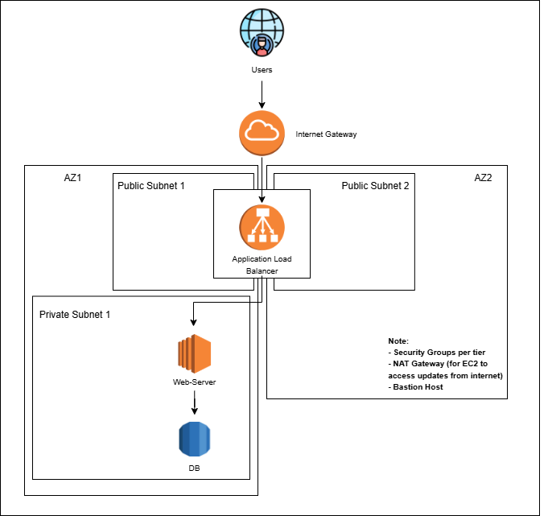

# AWS 3-Tier Architecture with Terraform

This project provisions a **3-tier AWS infrastructure** using Terraform:
- **Application Load Balancer (ALB)** in public subnets
- **EC2 Web Server** in private subnet (Ubuntu + PHP + Apache)
- **RDS MySQL Database** in private subnet
- NAT Gateway for private internet access

## Architecture

## Deployment
### Prerequisites
- AWS account
- Terraform installed
- AWS CLI configured (`aws configure`)

### Steps
git clone https://github.com/<your-username>/aws-3tier-terraform.git
cd aws-3tier-terraform
terraform init
terraform plan
terraform apply

## Access
Open the ALB DNS in your browser:
terraform output alb_dns_name
You should see:
✅ "Connected successfully to RDS!"

## What You'll Learn
1. Setting up VPC, subnets, and routing
2. Deploying EC2 behind ALB
3. Configuring RDS with security groups
4. Automating deployment with Terraform